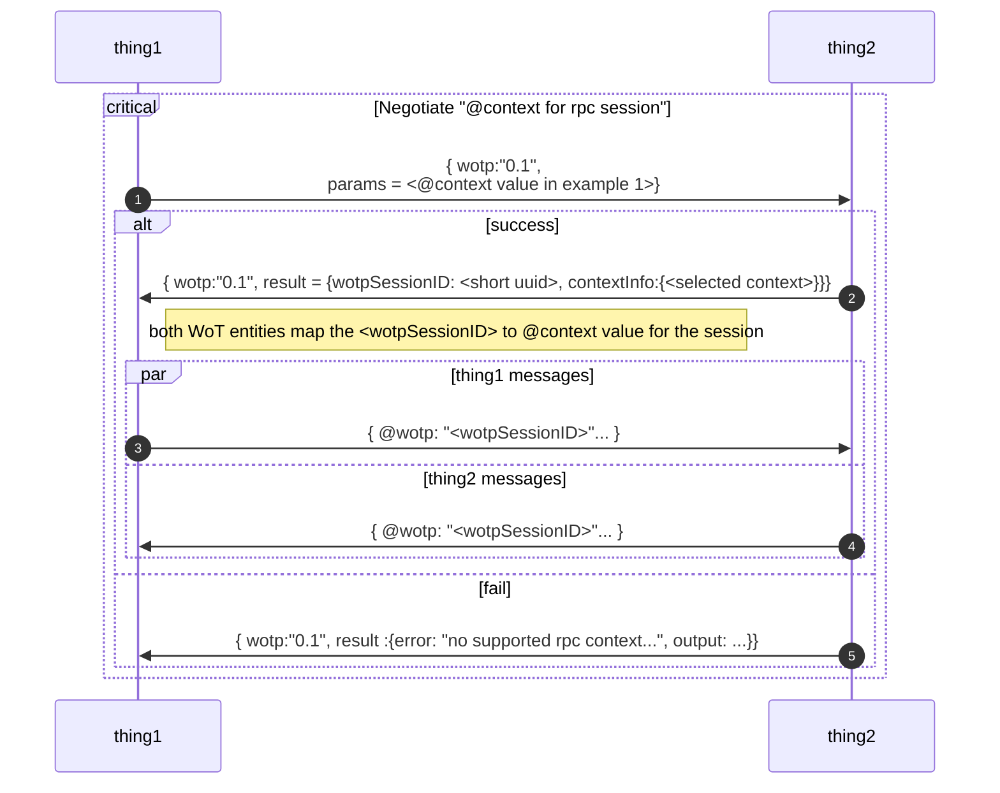

@hspaay my idea so far.
https://github.com/w3c/web-thing-protocol/issues/34#issuecomment-2568583540

## concept: equivalent jsonLD style rpc
assumption: this proposed web-thing-protocol (WoTP) is an **application
axiomatization** of _domain
axiomatization_:[The WoT Thing Description](https://www.w3.org/TR/wot-thing-description11/)

## goals

1. stay as close as possible to the semantics & ontology of
   [The WoT Thing Description: Hypermedia Controls Vocabulary Definitions](https://www.w3.org/TR/wot-thing-description11/#sec-hypermedia-vocabulary-definition)
2. maintain compatibility or easy conversion with json-rpc
3. expect to be used with something like protobuf to convert between json and
   binary
4. transmitted via websocket an ArrayBuff binary payload

my other assumptions/ideas

#### conversion of json-rpc member name

| Json-prc Request object members | proposed WoTP ontology names |
| ------------------------------: | :--------------------------- |
|                         jsonrpc | wotp                         |
|                          method | operation                    |

## syntax

```
"-->" = Request
"<--" = Response
```

## Request messages fields

| Request messages fields | Json-prc Request object members | proposed WoTP ontology names |
| ----------------------: | :------------------------------ | :--------------------------- |
|                    type | indicated by member names       |                              |
|               operation | method                          | op                           |
|                 thingID | param.thingID                   | thingID                      |
|                    name | param.name                      | affID(affordanceID)          |
|                   input | param.input                     | input                        |
|           correlationID | param.correlationID             | corrID                       |
|                senderID | param.senderID                  | senderID                     |
|               messageID | id                              | msgID                        |

example 1:
```
--> { 
        "jsonrpc": "2.0", 
        "method": "string", 
        "params": {
            "thingID": "string", 
            "name": "string", 
            "input": "any", 
            "correlationID": "string", 
            "senderID": "string"
        },
        "id": "string"
    }

======= with wotp parameter names: ========
--> { 
        "wotp": "<version>", 
        "op": "string", 
        "params": {
            "thingID": "string", 
            "affID": "string", 
            "input": <any>, 
            "corrID": "string", 
            "senderID": "string", 
            "msgId": "string"
        },
        "id": "string"
    }
```

## Notification messages fields

same as a Request except "id" is moved to "params" as "messageID"

example 2:
```
{
    "jsonrpc": "2.0",
    "method": "string", 
    "params": {
        "thingID": "string",
        ...
+   "messageID": "string"
    },
-   "id": "string"
}

====== becomes: ====== 
{ 
    "jsonrpc": "2.0",
    "method": "string", 
    "params": {
        "thingID": "string",
        ...
        "messageID": "string"
    }
}

======= using wotp member names: ========
{ 
        "wotp": "<version>",
        "op": "string", 
        "params": {
            "thingID": "string",
            ...
            "msgID": "string"
        }
}
```

## Response messages fields

| Response messages fields | Json-prc Request object members | proposed WoTP ontology names |
| -----------------------: | :------------------------------ | :--------------------------- |
|                     type | indicated by member names       |                              |
|                   status | result.status                   | status                       |
|                  thingID | result.thingID                  | thingID                      |
|                     name | result.name                     | affID(affordanceID)          |
|                   output | result.output                   | results                      |
|                    error | result.error                    | errors                       |
|                 received | result.received                 | rxTs                         |
|                  updated | result.updated                  | udTs                         |
|            correlationID | result.correlationID            | corrID                       |
|                messageID | id                              | msgId                        |

example 3:
```
<-- { 
        "jsonrpc": "2.0", 
        "method": "string", 
        "result": {
            "correlationID": "string",
            "error": "string",  
            "name": "string", 
            "output": "any",  
            "received": "string", 
            "status": "string", 
            "thingID": "string", 
            "updated": "string"
        },
        "id": "string"
    }

======= using wotp member names: ========
<-- { 
        "wotp": "<version>", 
        "op": "string",
        "result": {
            "corrID": "string",
            "error": "string",  
            "affID": "string", 
            "output": "any",  
            "rxTs": "string", 
            "status": "string", 
            "thingID": "string", 
            "udTs": "string"
        },
        "id": "string"
    }
```

## establish a message context
@benfrancis  
I am chewing on the idea of replacing the json-rpc version member with a json-LD style "@context" and use in a similar way "@context" is use in Wot thing description [example 1](https://www.w3.org/TR/wot-thing-description11/#simple-thing-description-sample)


